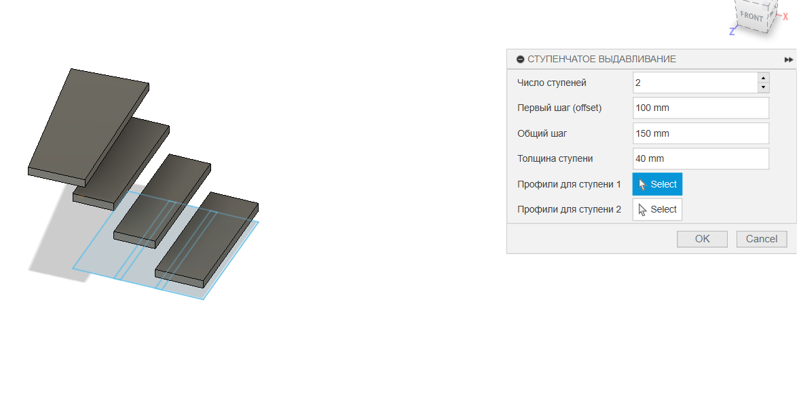

# PaniniFusionGPT — Ступенчатое выдавливание для Fusion 360

## Описание

Инструмент "Ступенчатое выдавливание" для Fusion 360 позволяет создавать несколько ступеней (экструдов) по выбранным профилям на разных скетчах с заданным шагом и толщиной.

## Возможности
- Задание количества ступеней
- Задание первого шага (offset), общего шага и толщины ступени
- Для каждой ступени — выбор одного или нескольких профилей (рекомендуется: для каждой ступени использовать отдельный скетч)
- Автоматическое создание тел-ступеней с нужным смещением и переименованием (step_1, step_2, ...)

## Как пользоваться
1. Установите аддон в Fusion 360 (см. стандартную инструкцию по установке скриптов).
2. Запустите команду "Ступенчатое выдавливание" из панели аддонов.
3. В появившейся форме:
    - Укажите число ступеней
    - Задайте первый шаг (offset), общий шаг и толщину ступени
    - Для каждой ступени выберите профиль (или несколько профилей) на отдельном скетче
4. Нажмите OK — ступени будут созданы автоматически.

## Важно
- **Для каждой ступени используйте отдельный скетч!**
- После применения инструмента тела-ступени будут переименованы в step_1, step_2 и т.д.

## Пример интерфейса

---

**Разработчик:** PaniniFusionGPT 